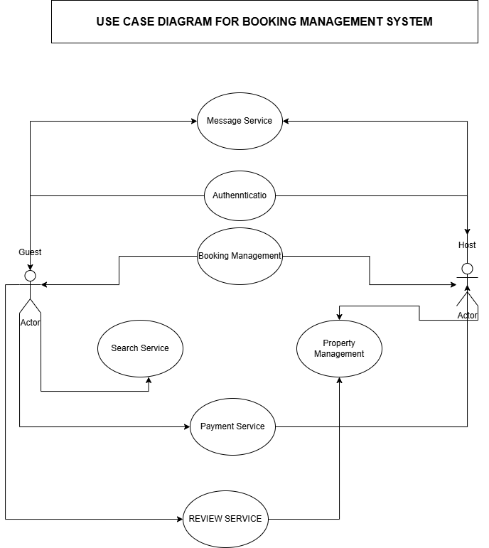

# Requirement Analysis in Software Development.
---
Have yoou ever wondered what it takes to create a booking management system such as `airbnb`?

In this requirement, we will explore the software requirements of such system.

## Purpose of this Repository
This repository contain the software requirement specification (SRR) of a booking management system (e.g airbnb)

## What is Requirement Analysis?
Requirement analysis is the first step of the software development process and software development life cycle (SDLC).

Requirement analysis is all about understanding what software is supposed to do and the constraints it must operate within.

## Why is Requirement Analysis Important?
Software Requirement Analysis is a critical phase in the Software Development Life Cycle (SDLC). Its importance lies in the fact that it sets the foundation for the entire project. Here’s why it's so important:

### 🔍 1. Clarifies What to Build
- It identifies what the client or end-user really needs—not just what they say they want.

- Prevents misunderstandings between stakeholders, developers, and users.

### 💰 2. Saves Time and Cost
- Detecting and fixing errors in requirements early is cheaper than doing it later in development or after release.

- Avoids unnecessary features and scope creep.

### 📄 3. Provides a Clear Roadmap
- Translates vague ideas into detailed, actionable requirements.

- Forms the basis for design, development, testing, and project management.

### 🔁 4. Ensures Better Planning and Estimation
- Helps in accurate time and cost estimation.

- Enables proper resource allocation and task scheduling.

### ✅ 5. Supports Validation and Verification
- Makes it easier to test and validate the system since requirements serve as a reference point for QA teams.

- Helps ensure the final product meets user needs and expectations.

### 🤝 6. Enhances Communication
- Acts as a communication bridge between developers, designers, testers, and stakeholders.

- Reduces ambiguity and conflicting assumptions.

## Key Activities in Requirement Analysis.
The software requirements phase is present in every software development project, and it is arguably the most important.
It can typically be broken down into the following key steps:

### 1. Requirement Gathering

Requirement gathering is the process of interacting with stakeholders (like clients, end-users, managers, and developers) to collect and document their needs, expectations, and constraints for a software project.

### 2. Requirement Elicitation
This is where the team actively gathers detailed information about what the software needs to do from the identified stakeholders.

 This is done through conducting interviews, surveys with key stake holders
 This step is critical because it’s about gathering as much relevant information as possible to ensure that the software is designed to meet the real needs of its users.
### 3. Requirement Documentation
The goal of this step is to create a clear, detailed record of what the software needs to do and the constraints within which it must operate.

The team typically creates a document called a Software Requirements Specification (SRS), which serves as a guide for everyone involved in the project.

### 4. Requirement Analysis and Modeling
This stage involves taking a closer look at the documented requirements to make sure they are realistic and workable.

The goal here is to finalize a set of requirements that is achievable and aligns with the overall objectives of the project.

### 5. Requirement Validation.
Validation is about confirming that the requirements actually meet the needs of the stakeholders and the goals of the project.

## **Types of Requirements**

In software development, requirements are typically categorized into **two main types**:

---

### 🔹 **Functional Requirements**

These define **what the system should do**—the specific services, features, or behaviors the software must provide to meet user needs.

#### ✅ **Examples in a Booking Platform like Airbnb:**

* **Property Management Service** – Enables hosts to manage their properties.
* **Search Service** – Allows guests to search for available accommodations.
* **Booking Service** – Lets users make reservations.
* **Payment Service** – Handles secure payments between guests and hosts.
* **Message Service** - Being able to message the host
* **Review Service** - Allow guest to leave a review for bookings

Functional requirements focus on **user goals and system functionality**.

---

### 🔸 **Non-Functional Requirements**

These describe **how the system should perform** rather than what it should do. They focus on the **quality attributes** of the system and enhance user experience.

#### 💡 **Common Non-Functional Requirements:**

* **Reliability** – The system should operate consistently without failure.
* **Security** – User data and transactions must be protected.
* **Performance** – The system should respond quickly and efficiently.
* **Scalability** – The system must handle increasing numbers of users or transactions.

**Example**

In a booking system, users should be able to book a property **within minutes**, and the system should **scale seamlessly** to handle high demand during peak seasons.

---
## Use Case Diagrams.

**✅ What Is a Use Case?**
A use case is a description of how a user (actor) interacts with a system to achieve a specific goal. It focuses on what the system does from the user's point of view.

### 🎯 Benefits of Use Case Diagrams
* **🔍 Clarifies Functional Requirements** - Shows what the system should do from a user's perspective
* **🤝 Improves Communication** - Helps stakeholders (clients, developers, testers) stay aligned
* **🔧 Assists in Planning and Testing** - Helps identify what features to implement and test
* **🧠 User-Focused Thinking** - Encourages thinking from the end user's point of view

## Acceptance Criteria
**✅ What is Acceptance Criteria in Requirement Analysis?**
Acceptance Criteria are a set of conditions or statements that a software product must satisfy for it to be accepted by the client, user, or tester. They define what "done" means for a particular feature or user story.

### ✅ **Feature: Checkout / Complete Booking**

#### **Acceptance Criteria:**

*  ✅ **The user must be logged in to complete the booking.**

* ✅ **The selected property must be available for the chosen dates.**

*  ✅ **The system should calculate the total cost based on selected dates, fees, and discounts.**

* ✅ **The user must be able to enter or select a valid payment method.**

* ✅ **Payment must be processed securely and successfully.**

* ✅ **Upon successful payment:**

   * The **user** receives a **booking confirmation email** with details (dates, property, total amount, host contact info).
   * The **host** receives a **booking notification email** with guest details and reservation info.

* ✅ **The property must be marked as "booked" for the selected dates**, and it should no longer be available for booking by others during that time.

* ✅ **The booking should appear in both the user’s and host’s dashboards** (e.g., under "Upcoming Bookings").

* ✅ **If payment fails**, the booking must **not be saved**, and the user should see an **error message with retry options**.